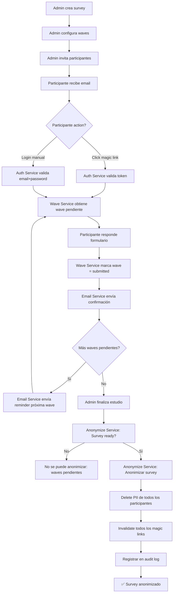

# EIPSI Forms - Arquitectura Longitudinal

**Versión:** 1.4.0 (Fase 0)  
**Fecha:** 2025-01-27  
**Estado:** ✅ Arquitectura preparada para implementación

---

## 📋 Índice

1. [Visión General](#visión-general)
2. [Decisiones de Design](#decisiones-de-design)
3. [Diagrama de Flujo](#diagrama-de-flujo)
4. [Naming Conventions](#naming-conventions)
5. [API Pública](#api-pública)
6. [Roadmap Visual](#roadmap-visual)
7. [Cambios a Archivos Existentes](#cambios-a-archivos-existentes)
8. [Notas de Migración](#notas-de-migración)

---

## Visión General

EIPSI Forms añade soporte para **estudios longitudinales con login de participantes**. Esto permite:

- **Registro de participantes** con email + password
- **Waves sucesivas** (baseline, follow-up 1, 2, 3, ...)
- **Magic links** para acceso directo sin login manual
- **Recordatorios automáticos** por email
- **Anonimización ética** al finalizar el estudio

### Principios Fundamentales

1. **Privacy-by-default:** Todos los datos sensibles se protegen por defecto
2. **Cero fricción:** Participantes acceden con 1 clic (magic links)
3. **Cero miedo:** Anonimización transparente y reversible hasta cierto punto
4. **Separación de responsabilidades:** Services layer con dependencias claras
5. **Migración segura:** dbDelta para cambios sin perder datos

---

## Decisiones de Design

### ¿Por qué email-based authentication?

**Alternativas consideradas:**
- ❌ **Fingerprint-only:** No funciona entre dispositivos, no permite login explícito
- ❌ **WordPress user accounts:** Sobrecarga la tabla wp_users, mezcla roles
- ✅ **Custom participant table:** Separación clara, control total, migración fácil

**Beneficios:**
- Participantes pueden acceder desde cualquier dispositivo
- No interfieren con usuarios de WordPress (admin, editores, etc.)
- Tabla propia con campos específicos (waves, assignments, etc.)
- Fácil exportación/migración a otros sistemas

### ¿Por qué Services Layer?

**Alternativas consideradas:**
- ❌ **Monolithic admin files:** Código difícil de mantener, testing complejo
- ❌ **Procedural functions:** Sin encapsulación, difícil inyección de dependencias
- ✅ **Service classes:** Testable, reutilizable, documentación clara en PHPDoc

**Beneficios:**
- **Separación de responsabilidades:** Cada servicio tiene una tarea clara
- **Testing:** Funit tests por servicio sin dependencias cruzadas
- **Documentación:** PHPDoc en cada método con @return y @param
- **Reutilización:** Los mismos servicios se usan en admin, frontend y cron
- **Future-proof:** Fácil cambiar implementación sin afectar callers

### ¿Por qué Magic Links?

**Alternativas consideradas:**
- ❌ **Solo login manual:** Alta fricción para participantes mayores
- ❌ **Tokens en email:** Seguridad débil, expiran rápido
- ✅ **Magic links con token hasheado:** Seguro, reutilizable, auditable

**Beneficios:**
- **Cero fricción:** Participante hace clic y ya está logueado
- **Seguro:** Token hasheado en DB, expira en 48h, un solo uso
- **Auditable:** Cada uso se registra en wp_survey_email_log
- **Flexible:** Puede combinarse con login manual si es necesario

### ¿Por qué Wave Model?

**Alternativas consideradas:**
- ❌ **Solo timestamp en respuestas:** Difícil consultar waves pendientes
- ❌ **Configuración inline:** Hardcoded en cada formulario, difícil escalar
- ✅ **Waves como entidades separadas:** Flexibilidad total, asignación dinámica

**Beneficios:**
- **Flexibilidad:** Cada wave puede tener diferente formulario
- **Auditable:** Asignaciones con status tracking (pending → in_progress → submitted)
- **Escalable:** Fácil agregar waves sin modificar código
- **Reutilizable:** Mismos waves pueden asignarse a múltiples participantes

### ¿Por qué Schema Versioning?

**Alternativas consideradas:**
- ❌ **Migraciones manuales:** Error-prone, difícil rastrear cambios
- ❌ **Sin versionado:** Imposible saber qué versión de schema tiene un sitio
- ✅ **dbDelta + version option:** Automático, seguro, reversible

**Beneficios:**
- **Migración automática:** Al activar plugin, dbDelta crea/actualiza tablas
- **Reversible:** Siempre posible volver a versión anterior
- **Audit track:** Option `eipsi_longitudinal_db_version` indica versión actual
- **Future-proof:** Fácil agregar columnas sin romper datos existentes

---

## Diagrama de Flujo

### Flujo Completo: Registro → Wave → Submit → Anonimizar



### Detalle de Login con Magic Link

```
1. Admin invita participante
   ↓
2. Email Service genera magic link
   - Token único (64 caracteres)
   - Almacena en wp_survey_magic_links
   - URL: site_url()?eipsi_magic={token}
   ↓
3. Email enviado con magic link
   ↓
4. Participante hace clic en email
   ↓
5. Frontend detecta ?eipsi_magic={token}
   ↓
6. Auth Service valida token
   - Busca en wp_survey_magic_links
   - Verifica: no expirado, no usado, max_uses no alcanzado
   ↓
7. Token válido?
   - Sí: Crear sesión, redirigir a wave
   - No: Mostrar error, pedir login manual
   ↓
8. Participante responde wave
   ↓
9. Wave Service marca wave = submitted
   ↓
10. Email Service envía confirmación
```

### Detalle de Anonimización

```
1. Admin solicita anonimizar survey
   ↓
2. Anonymize Service: can_anonymize_survey()
   - Verifica: no waves pendientes
   - Verifica: todos los participantes con al menos 1 wave completada
   ↓
3. Puede anonimizar?
   - No: Mostrar error con razón
   - Sí: Pedir confirmación (WARNING: irreversible)
   ↓
4. Admin confirma
   ↓
5. Anonymize Service: anonymize_survey()
   - Iniciar transacción DB
   - Para cada participante:
     • delete_pii() → email, password, nombre
     • invalidate_participant_magic_links()
     • Participant_Service::set_active(false)
   - invalidate_magic_links(survey_id)
   - audit_log('anonymize_survey')
   - Commit transacción
   ↓
6. ✅ Survey anonimizado
   - Datos clínicos conservados (sin PII)
   - Audit log completo
   - Magic links invalidados
```

---

## Naming Conventions

### Tablas de Base de Datos

Todas las tablas longitudinales usan el prefijo `wp_survey_`:

| Tabla | Propósito |
|-------|-----------|
| `wp_survey_participants` | Datos de participantes (login, PII) |
| `wp_survey_sessions` | Sesiones activas (tokens, expiración) |
| `wp_survey_waves` | Definición de waves (forms, due dates) |
| `wp_survey_assignments` | Vinculación participante ↔ wave (status) |
| `wp_survey_magic_links` | Magic links para acceso directo |
| `wp_survey_email_log` | Historial de emails enviados |
| `wp_survey_audit_log` | Auditoría de acciones sensibles |

**Naming pattern:**
- Singular: `participant`, `session`, `wave` (no `participants`)
- Foreign keys: `participant_id`, `survey_id`, `wave_id`
- Status enums: `'pending'`, `'in_progress'`, `'submitted'`
- Timestamps: `created_at`, `updated_at`, `expires_at`, `submitted_at`, `last_login_at`

### Services Classes

Todos los servicios siguen el patrón `EIPSI_{Domain}_Service`:

| Clase | Responsabilidad |
|-------|-----------------|
| `EIPSI_Participant_Service` | CRUD de participantes, password verification |
| `EIPSI_Auth_Service` | Login, logout, sessions, magic links |
| `EIPSI_Wave_Service` | Crear waves, asignar, marcar progress |
| `EIPSI_Email_Service` | Envío de emails, magic links, log |
| `EIPSI_Anonymize_Service` | Anonimización, audit log, PII deletion |

**Naming pattern:**
- Methods públicos: `public static function {action}_{resource}()`
  - Ej: `create_participant()`, `get_by_email()`, `verify_password()`
- Métodos internos: `private static function {action}_{resource}_internal()`
  - Ej: `hash_password_internal()`, `validate_token_internal()`

### Config Constants

Todas las constantes usan el prefijo `EIPSI_`:

| Patrón | Ejemplo |
|--------|---------|
| Session config | `EIPSI_SESSION_TTL_HOURS`, `EIPSI_SESSION_COOKIE_NAME` |
| Magic links | `EIPSI_MAGIC_LINK_EXPIRY_HOURS`, `EIPSI_MAGIC_LINK_MAX_USES` |
| Waves | `EIPSI_WAVE_INDEX_MIN`, `EIPSI_WAVE_DEFAULT_STATUS` |
| Email | `EIPSI_CRON_EMAIL_RATE_LIMIT`, `EIPSI_WAVE_MAX_REMINDERS` |
| Anonymize | `EIPSI_ANONYMOUS_EMAIL_PREFIX`, `EIPSI_AUDIT_REQUIRED_ACTIONS` |

### Database Query Patterns

```php
// SELECT: Usar $wpdb->prepare() para SQL injection protection
$participants = $wpdb->get_results($wpdb->prepare(
    "SELECT * FROM {$wpdb->prefix}survey_participants 
     WHERE survey_id = %d AND email = %s",
    $survey_id,
    $email
));

// INSERT: Usar $wpdb->insert()
$wpdb->insert(
    $wpdb->prefix . 'survey_participants',
    array(
        'survey_id' => $survey_id,
        'email' => $email,
        'password_hash' => $password_hash,
        'created_at' => current_time('mysql'),
    ),
    array('%d', '%s', '%s', '%s') // format: %d=integer, %s=string
);

// UPDATE: Usar $wpdb->update()
$wpdb->update(
    $wpdb->prefix . 'survey_participants',
    array('last_login_at' => current_time('mysql')),
    array('id' => $participant_id),
    array('%s'),
    array('%d')
);

// DELETE: Usar $wpdb->delete()
$wpdb->delete(
    $wpdb->prefix . 'survey_sessions',
    array('token' => $token),
    array('%s')
);
```

---

## API Pública

### Métodos Externos (usados por admin, frontend, cron)

#### Participant_Service

```php
// Crear nuevo participante
EIPSI_Participant_Service::create_participant($survey_id, $email, $password)
→ array { success, participant_id, error }

// Obtener participante
EIPSI_Participant_Service::get_by_email($survey_id, $email)
→ object|null { id, email, password_hash, first_name, last_name, ... }

// Verificar password
EIPSI_Participant_Service::verify_password($participant_id, $plain_password)
→ bool

// Actualizar último login
EIPSI_Participant_Service::update_last_login($participant_id)
→ bool

// Marcar activo/inactivo
EIPSI_Participant_Service::set_active($participant_id, $is_active)
→ bool
```

#### Auth_Service

```php
// Login con email+password
EIPSI_Auth_Service::authenticate($survey_id, $email, $password)
→ array { success, participant_id, error }

// Crear sesión tras login/magic link
EIPSI_Auth_Service::create_session($participant_id, $survey_id, $ttl_hours = 168)
→ bool

// Obtener participante actual
EIPSI_Auth_Service::get_current_participant()
→ int|null

// Logout
EIPSI_Auth_Service::destroy_session()
→ bool

// Verificar si hay sesión activa
EIPSI_Auth_Service::is_authenticated()
→ bool
```

#### Wave_Service

```php
// Obtener waves pendientes
EIPSI_Wave_Service::get_pending_waves($participant_id, $survey_id)
→ array [{ id, wave_index, form_template_id, due_at, status }]

// Obtener próxima wave pendiente
EIPSI_Wave_Service::get_next_pending_wave($participant_id, $survey_id)
→ object|null

// Marcar wave como iniciada
EIPSI_Wave_Service::start_wave($participant_id, $survey_id, $wave_id)
→ bool

// Marcar wave como completada
EIPSI_Wave_Service::complete_wave($participant_id, $survey_id, $wave_id)
→ bool

// Crear nueva wave (admin)
EIPSI_Wave_Service::create_wave($survey_id, $wave_index, $form_template_id, $due_at)
→ int|false (wave_id)

// Asignar wave a participante
EIPSI_Wave_Service::assign_wave_to_participant($participant_id, $survey_id, $wave_id)
→ bool
```

#### Email_Service

```php
// Generar magic link
EIPSI_Email_Service::generate_magic_link($participant_id, $wave_id)
→ string (full URL with token)

// Enviar recordatorio
EIPSI_Email_Service::send_wave_reminder($participant_id, $wave_id, $custom_message)
→ bool

// Enviar bienvenida
EIPSI_Email_Service::send_welcome_email($participant_id, $survey_id, $temp_password)
→ bool

// Registrar envío
EIPSI_Email_Service::log_email_sent($participant_id, $type, $wave_id, $status, $error_message, $metadata)
→ bool

// Obtener historial de emails
EIPSI_Email_Service::get_email_history($participant_id, $survey_id, $limit = 50)
→ array [{ id, email_type, sent_at, status, ... }]
```

#### Anonymize_Service

```php
// Anonimizar survey completo
EIPSI_Anonymize_Service::anonymize_survey($survey_id, $audit_reason)
→ array { success, anonymized_count, error }

// Anonimizar un solo participante
EIPSI_Anonymize_Service::anonymize_participant($participant_id, $audit_reason)
→ array { success, error }

// Verificar si puede anonimizarse
EIPSI_Anonymize_Service::can_anonymize_survey($survey_id)
→ array { can_anonymize, reason }

// Obtener audit log
EIPSI_Anonymize_Service::get_survey_audit_log($survey_id, $limit = 100)
→ array [{ action, actor_type, created_at, ... }]
```

### Métodos Internos (privados, no usar fuera)

Los siguientes métodos son **privados** y no deben usarse externamente:

- `Participant_Service::hash_password_internal()` - Hashear passwords
- `Auth_Service::generate_token_internal()` - Generar tokens de sesión
- `Auth_Service::validate_token_internal()` - Validar tokens
- `Email_Service::render_template_internal()` - Renderizar plantillas de email
- `Anonymize_Service::audit_log_internal()` - Registrar en audit log

**Nota:** Si necesitas usar un método interno, crea un método público wrapper en el servicio correspondiente.

---

## Roadmap Visual

### Fase 0: Arquitectura (✅ COMPLETADO - ESTE DOCUMENTO)

- [x] Crear `/admin/services/` con 5 clases (stubs)
- [x] Crear `/admin/config/longitudinal-config.php` con constantes
- [x] Definir 7 tablas nuevas en schema manager
- [x] Documentación arquitectónica completa
- [x] Integración en `eipsi-forms.php` (require de services)
- [x] Build OK, lint JS OK

### Fase 1: Login + Sessions (PENDIENTE)

- [ ] Implementar `Participant_Service` (CRUD completo)
- [ ] Implementar `Auth_Service` (login, sessions, cookies)
- [ ] Implementar `Anonymize_Service::audit_log()` (audit log básico)
- [ ] Crear tabla `wp_survey_participants`
- [ ] Crear tabla `wp_survey_sessions`
- [ ] Crear tabla `wp_survey_audit_log`
- [ ] Frontend: Página de login (shortcode `[eipsi_login]`)
- [ ] Frontend: Página de dashboard de waves (`[eipsi_participant_dashboard]`)
- [ ] Admin: Interfaz para gestionar participantes

### Fase 2: Waves + Magic Links (PENDIENTE)

- [ ] Implementar `Wave_Service` (CRUD completo)
- [ ] Implementar `Email_Service` (envío de emails, magic links)
- [ ] Crear tabla `wp_survey_waves`
- [ ] Crear tabla `wp_survey_assignments`
- [ ] Crear tabla `wp_survey_magic_links`
- [ ] Crear tabla `wp_survey_email_log`
- [ ] Admin: Interfaz para crear waves
- [ ] Admin: Interfaz para asignar waves a participantes
- [ ] Frontend: Renderizado de wave en formulario
- [ ] Cron: Recordatorios automáticos de waves pendientes

### Fase 3: Anonimización Ética (PENDIENTE)

- [ ] Implementar `Anonymize_Service` (completo)
- [ ] Validación de precondiciones (can_anonymize_survey)
- [ ] Anonimización de PII (delete_pii)
- [ ] Invalidación de magic links
- [ ] Admin: Interfaz para anonimizar survey con confirmación
- [ ] Admin: Interfaz para ver audit log
- [ ] Test: Verificar que PII se borra pero datos clínicos se conservan

### Fase 4: Email Templates (PENDIENTE)

- [ ] Diseñar plantillas de email HTML responsive
- [ ] Plantilla de bienvenida
- [ ] Plantilla de recordatorio de wave
- [ ] Plantilla de confirmación de envío
- [ ] Admin: Interfaz para personalizar plantillas
- [ ] Multilenguaje: Español + Inglés

### Fase 5: Testing (PENDIENTE)

- [ ] Unit tests para todos los servicios
- [ ] Integration tests para flujo completo
- [ ] End-to-end tests con Playwright
- [ ] Test de migración desde v1.3.x
- [ ] Test de anonimización (verificar PII borrado)
- [ ] Test de magic links (expiración, max_uses)

### Fase 6: Release (PENDIENTE)

- [ ] Actualizar versión a 1.4.0
- [ ] Changelog completo
- [ ] Documentación para usuarios
- [ ] Migration guide para v1.3.x → v1.4.0
- [ ] Beta test con usuarios piloto
- [ ] Release candidate
- [ ] Release estable

---

## Cambios a Archivos Existentes

### eipsi-forms.php

**Nuevas líneas (~31-50):**

```php
// Configuración longitudinal (línea ~31)
require_once EIPSI_FORMS_PLUGIN_DIR . 'admin/config/longitudinal-config.php';

// Servicios longitudinales (línea ~50)
require_once EIPSI_FORMS_PLUGIN_DIR . 'admin/services/class-participant-service.php';
require_once EIPSI_FORMS_PLUGIN_DIR . 'admin/services/class-auth-service.php';
require_once EIPSI_FORMS_PLUGIN_DIR . 'admin/services/class-wave-service.php';
require_once EIPSI_FORMS_PLUGIN_DIR . 'admin/services/class-email-service.php';
require_once EIPSI_FORMS_PLUGIN_DIR . 'admin/services/class-anonymize-service.php';
```

**Cambios mínimos:**
- Solo se agregan `require_once` sin modificar código existente
- No se rompe backward compatibility
- Las clases se cargan pero no se ejecutan hasta Fase 1

### admin/database-schema-manager.php

**Nuevos métodos (~714-800):**

```php
/**
 * Sync wp_survey_participants table in local DB
 */
private static function sync_local_survey_participants_table() {
    // TODO: Implementar en Fase 1
}

/**
 * Sync wp_survey_waves table in local DB
 */
private static function sync_local_survey_waves_table() {
    // TODO: Implementar en Fase 2
}

/**
 * Sync wp_survey_assignments table in local DB
 */
private static function sync_local_survey_assignments_table() {
    // TODO: Implementar en Fase 2
}

/**
 * Sync wp_survey_magic_links table in local DB
 */
private static function sync_local_survey_magic_links_table() {
    // TODO: Implementar en Fase 2
}

/**
 * Sync wp_survey_email_log table in local DB
 */
private static function sync_local_survey_email_log_table() {
    // TODO: Implementar en Fase 2
}

/**
 * Sync wp_survey_audit_log table in local DB
 */
private static function sync_local_survey_audit_log_table() {
    // TODO: Implementar en Fase 1
}
```

**Cambios en verify_and_sync_schema():**

```php
// En verify_and_sync_schema(), rama local (línea ~80):
$rct_assignments_sync = self::sync_local_randomization_assignments_table();
// Agregar después:
$participants_sync = self::sync_local_survey_participants_table();
$waves_sync = self::sync_local_survey_waves_table();
$assignments_sync = self::sync_local_survey_assignments_table();
$magic_links_sync = self::sync_local_survey_magic_links_table();
$email_log_sync = self::sync_local_survey_email_log_table();
$audit_log_sync = self::sync_local_survey_audit_log_table();

$results['survey_participants_table'] = $participants_sync;
$results['survey_waves_table'] = $waves_sync;
$results['survey_assignments_table'] = $assignments_sync;
$results['survey_magic_links_table'] = $magic_links_sync;
$results['survey_email_log_table'] = $email_log_sync;
$results['survey_audit_log_table'] = $audit_log_sync;
```

**Sin cambios en:** `repair_local_schema()` hasta Fase 1-3

### Otros archivos

**Sin cambios en Fase 0:**
- `admin/database.php` - Sin cambios
- `admin/handlers.php` - Sin cambios
- `includes/shortcodes.php` - Sin cambios
- Frontend assets - Sin cambios

---

## Notas de Migración

### Desde v1.3.x a v1.4.0

**¿Qué cambia?**
- Se agregan 7 tablas nuevas (`wp_survey_*`)
- Se agregan 5 servicios nuevos en `/admin/services/`
- Se agrega archivo de configuración `longitudinal-config.php`

**¿Qué NO cambia?**
- Tablas existentes (`wp_vas_form_results`, `wp_vas_form_events`, etc.) **NO** se modifican
- Bloques Gutenberg **NO** cambian
- Funcionalidad existente (forms, export, analytics) **NO** cambia
- Compatibilidad 100% backward

**Migración automática:**

1. Activar plugin v1.4.0
2. `eipsi_forms_activate()` ejecuta dbDelta para tablas nuevas
3. `EIPSI_Database_Schema_Manager::verify_and_sync_schema()` sincroniza schema
4. Opción `eipsi_longitudinal_db_version` se actualiza a `1.0.0`
5. ✅ Listo, sin intervención manual

**Rollback a v1.3.x:**

1. Desactivar plugin v1.4.0
2. Instalar v1.3.x
3. Tablas `wp_survey_*` quedan en DB pero no se usan (no causan conflictos)
4. Funcionalidad v1.3.x funciona normalmente

**Datos perdidos en rollback:**

- ⚠️ Participantes, waves, assignments, magic links creados en v1.4.0 **NO** están disponibles en v1.3.x
- ⚠️ Pero respuestas de formularios (`wp_vas_form_results`) **SÍ** se conservan

### Consideraciones de Producción

**Antes de actualizar a v1.4.0:**

1. **Backup completo de DB:**
   ```bash
   wp db export backup-pre-v1.4.0.sql
   ```

2. **Verificar espacio en DB:**
   - Tablas nuevas requieren ~5-10 MB adicionales (depende del tamaño del estudio)
   - Asegurar que no se exceda límite del hosting

3. **Testing en staging:**
   - Actualizar en staging primero
   - Probar flujo completo con participantes de prueba
   - Verificar que no hay warnings en PHP error log

**Después de actualizar:**

1. **Verificar tablas creadas:**
   ```sql
   SHOW TABLES LIKE 'wp_survey_%';
   -- Debe mostrar: participants, sessions, waves, assignments, magic_links, email_log, audit_log
   ```

2. **Verificar versión:**
   ```php
   echo get_option('eipsi_longitudinal_db_version'); // Debe ser "1.0.0"
   ```

3. **Revisar error log:**
   ```bash
   tail -f wp-content/debug.log | grep EIPSI
   -- No debe haber errores o warnings
   ```

### Troubleshooting

**Tablas no se crean:**

- Verificar permisos de DB usuario (CREATE, ALTER)
- Verificar que `dbDelta()` está disponible (`require_once ABSPATH . 'wp-admin/includes/upgrade.php'`)
- Revisar error log en `wp-content/debug.log`

**Conflictos con tablas existentes:**

- Si ya existe tabla `wp_survey_participants` de otro plugin, cambiar prefijo en `longitudinal-config.php`
- Usar `define('EIPSI_TABLE_PREFIX', 'eipsi_')` para prefijo personalizado

**Servicios no cargan:**

- Verificar que `require_once` paths son correctos en `eipsi-forms.php`
- Verificar que no hay syntax errors en PHP (linting)
- Revisar error log para Class not found errors

---

## Conclusión

Esta arquitectura está diseñada para ser:

- **Flexible:** Fácil agregar nuevas funcionalidades sin modificar código existente
- **Segura:** Privacy-by-default, audit log completo, tokens hasheados
- **Escalable:** Services layer testable, migraciones versionadas
- **Mantenible:** Documentación clara, naming consistente, código bien comentado

**Próximos pasos (Fase 1):**
- Implementar lógica de `Participant_Service` y `Auth_Service`
- Crear frontend de login y dashboard
- Testing end-to-end de flujo de registro

---

**Fin de Documentación Arquitectónica**  
**EIPSI Forms v1.4.0 - Fase 0**  
**Última actualización:** 2025-01-27
